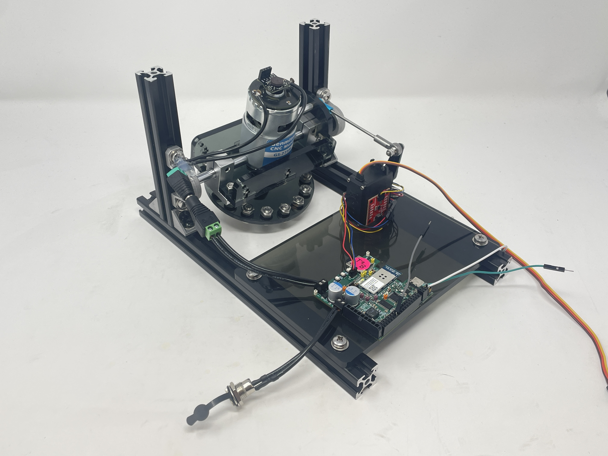
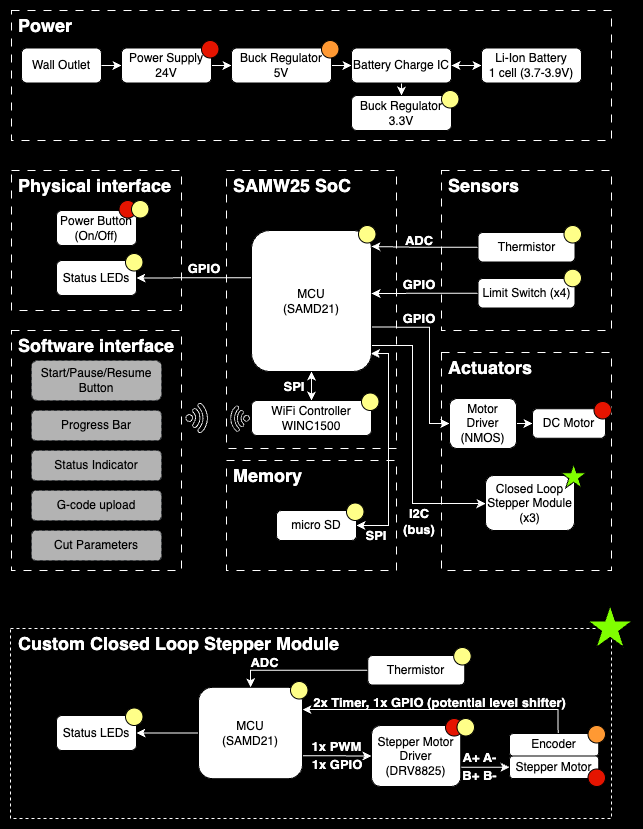

# a14g-final-submission

    * Team Number: 9
    * Team Name: Shorts & Sparks
    * Team Members: James Steeman and Tim Zhang
    * Github Repository URL: https://github.com/ese5160/a14g-final-submission-s25-t09-shorts-sparks
    * Description of test hardware: Detkin Desktop (Windows 10), MacBook Pro M2 (Mac OS), Our PCBAs, LSM6DSO IMU, Servo Motor, DC motor, our mechanical assembly
    
    (development boards, sensors, actuators, laptop + OS, etc) 

## 1. Video Presentation

[Video in Google Drive](https://drive.google.com/file/d/10uaTPHjv0_yxICQpvfujqLQYtL-Gkd34/view?usp=sharing)

## 2. Project Summary

### Device Description:  

Brief Project Description.

- Our final device is a boat active stabilization device (Seakeeper) to combat the rocking (roll) motion of a boat at sea due to waves, improving rider comfort. The system uses an IMU to detect boat tilting and uses the gyroscopic precession effect of a spinning flywheel to counteract the motion.
- For most of the semester, our project was a 3 axis CNC machine for milling prototype PCBs. Due to board issues discovered and isolated to problems outside of our control during board bringup, we worked with the Teaching Team to do a very late project change to salvage our PCB in a demoable project. Read here for more information on board issues: [Board Issues Google Document](https://docs.google.com/document/d/17aVozhZWAjP6q5agUZiOJsjJb8daSV915WeSpyRnOJc/edit?usp=sharing)

What inspired you to do the project? What problem is your device solving?

- The inspiration for our project was less of an "inspiration", more of a "maximize what we had". PCB manufacturing issues made our original project (3 axis CNC machine for milling prototype PCBs) impossible due to some critical component failures. We took everything that we found functional on our PCB, and asked ourselves what is the coolest project we could make. Specifically, the most functional of our three boards was semi functional including the SAMW25, MOSFET + gate drive IC for a big DC motor, separate SAMD21, stepper driver, all of the power regulation (24V, 5V, 3.3V) and a QWIIC connector for external I2C. From here, we came up with the boat stabilizer idea (control moment gyro/CMG) as it perfectly maximizes our functional hrdware. Our original CNC spindle motor was repurposed to spin a flywheel, the stepper motor connected to the SAMD21 could be used as the gimbal actuator (later decided to use a simple servo controlled by the SAMW25 instead), and the QWIIC connector allows us to connect an external IMU to measure a the tilt of a boat so that the CMG could actively compensate and counteract the rocking motion.

How do you use the Internet to augment your device functionality?

- The stabilization device could also be activated remotely (e.g. on a private yatch, the user does not need to go to the control room and could activate it from their phone/internet connected device). The data of the boat's tilt is also transfered live to a dashboard which anyone anywhere could see, such as friends and family on shore. In addition, this allows for additional features such as "text emergency contact" when the boat is detected to have capsized in rough waters.

### Device Functionality

The entire system revolves(get it? haha) around the flywheel. Using the principle of gyroscopic precession, this allows us to tilt the flywheel back and forth (pitch), and produce a rolling tourque to counteract waves rocking a boat (usually boats are longer than they are wide so the largest tilt is in this axis). Our large DC motor (original CNC spindle), will spin up a laser cut disk with slots for 16 large bolts along the circomference (DIY flywheel with max rotational inertia). This inertia combined with a very high RPM (~5000 with 25% full power) gives us a large amount of stored angular momentum to use and counteract the boat rocking side to side. A servo motor is used to act as the gimbal actuator to tilt the flywheel assembly back and forth as it is very simple and provides decent torque. An IMU is used which allows us to measure current tilt and correct for it inside of a PID loop (originally also planend for a kalman filter with sensor fusion bt once again time was extreemly limited). All of the processing is handled by the SAMW25 which runs Free RTOS to simultaneously perform active stability compensation and other tasks such as CLI, and WIFI communication with Node-Red Dashboard.

- Sensor: IMU
- Actuator: DC motor, Servo
- Processing: SAMW25

### Challenges

Where did you face difficulties? This could be in firmware, hardware, software, integration, etc.

- Our major challenge was hardware (and as a result a lack of time), due to unforseen factors from the manufactures that caused several unfixable PCB issues (possibly due to wrong reflow temperature that killed the ICs). This quite literally killed our original project, leaving us only 3 days to try to implement and demo a new project from scratch. Again, this document provides specific information on board issues: [Board Issues Google Document](https://docs.google.com/document/d/17aVozhZWAjP6q5agUZiOJsjJb8daSV915WeSpyRnOJc/edit?usp=sharing)

- The new project suffered from lack of development/debugging time, with potential further hardware issues that we did not have time to pinpoint (unable to move our gimbal actuator as we could not get a second PWM instance on a different tcc unit to output from other pins. Tried 8 total pins, only the one used for the flywheel motor worked). This meant that we were unable to demonstrate the full integrated active roll compensation (which was the main selling point).

How did you overcome these challenges?

- These fundamental challenges were in a way "impossible" to overcome, but we were able to make the most out of what was possible. Over the course of 3 days into the demo and a few hours of refinement post-demo day (Node-RED otafu and additional servo troubleshooting), we were able to: 
   1. Successfully completed a new mechanical CAD and finished the physical construction which had all the necessary features of a fully functioning CMG.
   2. Rebuilt our Node-RED rebuilt dashboard interface, integrated flywheel power setting, logging IMU data (boat tilt), manual/automatic activation of the system, OTAFU, boat capsize detection that will alert the dashboard and text a phone number.
   3. Wrote drivers for our new I2C device (IMU), and successfully read out the data of interest and send over to dashboard for data visualization + logging.
   4. Wrote a motor dc control driver that will ramp up/dpwn the speed to any user set speed from the dashboard.

- Due to potentially even more hardware issue, we were unable to generate a second PWM for the gimbal actuator (servo), which unfortunately also limited our ability to do a full integration of everything. Some of the attempted pins did generate pwm using the dev board, but given the end of semester and final exams, we did not have time to completely isolate and troubleshoot this issue to a resolution.

### Prototype Learnings

What lessons did you learn by building and testing this prototype?

- We learned a lot about the manufacturing and developing process and considerations to make in the planning and execution stages of prototyping.
    - Design your intial PCB prototype to be easily reworkable to make up for both design and manufacturing mistakes
    - Understand your manufacturer capabilities by developing subsection or component test boards (this can also help you get a sense of layout and routing regarding said component). This can help make sure the manufacturing process, such as reflow temp, is successful with the IC before integrating into the larger system
- How to isolate/assess the where issues come from between design, firmware, and chip / manufacturing issues
- Gain famililiarity on dev board to get code / mcu development familiarity before doing pin assigment on PCBA
- Many more!

What would you do differently if you had to build this device again?

- One thing I would do differently is minimizing risk from the beginning of the project. Either modifying the initial idea CNC or conceptulizing it in a way that the whole system can run from a single PCBA would have been helpful for mitigating risk with board manufacturing issues.
- Overall, if done outside the time constraints of the course I have tried to develop a whole working system or at least proof of concept on development boards to get more familiar with the components and firmware considerations before PCB design. This would also help mitigate firmware vs hardware vs manufacturing issues when doing board bringup and final development and integration of the device on the PCBAs.
- A small change for the PCBs would be using slightly larger test points and traces whenever possible, which would have made rework soldering a bit more pleasant.
- I think our approach to the second project was mostly good, but again mitigating risk would have saved some time. For instance, we thought we could still use both MCUs and the stepper motor driver, and I spent some time trying to put together a rushed UART commincation between the MCUs by repurposing pin connections from the original CNC idea. This made the implementation of the system unecessarily complex, and wasted time. Eventually we gave up on that and switched to a servo using SAMW25 pwm, which could have been done from the beginning

### Next Steps & Takeaways

What steps are needed to finish or improve this project?

- For the Gyro, next steps would to be find and resolve the TCC PWM issue on all other pins and use a working pin for the servo motor. Then develop a driver for the servo to ramp speed to provide torque to boat
    - Implement kalman filter for sensor fusion
    - Implement PID for tilt compensation (moving servo)

What did you learn in ESE5160 through the lectures, assignments, and this course-long prototyping project?

- The lectures gave a initial idea of embedded design considerations, the approach to Altium, RTOS fundamentals, and bootloader and otafu fundamentals
- The assignments expanded on these and gave opportunity for practical implementation experience and a deeper understanding

### Project Links

[Node Red UI Instance](http://172.190.141.169:1880/ui/#!/0?socketid=IxHLWtM_3o6IbezjAABr)

[Altium 365 Link](https://upenn-eselabs.365.altium.com/designs/DDC6BC9F-ABAE-498F-8839-63F1F02EF066)

## 3. Hardware & Software Requirements

Note: Since we had a late project change, we have created new HRS and SRS for the new project (post-facto) based on our goals when this project was created. We will attempt to evaluate our final output relative to these goals that reflect the ideal new project expectations. We recognize that some of these requirements are very basic and could be developed much further to frame a project, but since they were made post facto and again very limited time (we focused more on actual implementation for as long as possible) we hope this is sufficient to have some picutre of the intentions

### HRS

| Req ID | Requirement | Review |
| ------ | ----------- | ------ |
| HRS-01 | We shall repurpose the PCBA from the CNC project using as much hardware as possible | Success: we used the PCBA. Used everything besides SAMD21 and stepper motor driver (timeline constraint) |
| HRS-02 | We shall reporpose as much of mechanical hardware as possible | Success: Used the Spindle motor as flywheel motor, bearing blocks, linear rods, aluminum extrusion, ... See pictures/video to see structure |
| HRS-03 | The DC flywheel shall be driven with a mosfet driver to allow for PWM speed control | Success: See video demos for control |
| HRS-04 | The system shall have external non-voilatile memory (microSD) of no less than 512MB for storing G-code and current progress (in any pause scenario) | N/A |
| HRS-05 | An IMU shall sample acceleartion and gyro in necessary axes (gz, ax, ay) at at least 200 Hz (for Kalman filter input) | Success: The refresh rate of IMU is 417 Hz, and we sample in an RTOS task running at 200 Hz ?Testing video? |
| HRS-06 | The system shall use a stepper motor to change the angle of the flywheel and provide a torque to the boat | Fail: We switched to a servo motor |
| HRS-07 |  | N/A |
| HRS-08 |  | N/A |
| HRS-09 |  | N/A |
| HRS-10 |  | N/A |

I recog

Stepper motor - Fail --> servo motor from another SAMW pin

### SRS

UART SAMW to SAMD for communication between mcus on board - Fail -->

PWM at 10khz (ish) for 

Ramp changes in dc motor PWM for ...

Node red / wifi interfacing for remote data show and user input

OTAFU implemented (show node red and / or cli) (note bootloader existance?)

Drivers?

Requests and receives imu data at 200 hz to input into 200hz kalman filter -> 100hz pid motor control loop

### CNC Machine Requirements from A07G, noting differences from original proposal in A00G

| Original | Current |
| -------- | ------- |
| Foam cyllinders 3d model prototypes |  Copper clad FR4 for milling PCB prototypes |
| r(z), y, theta (cyllinder) cnc | x, y, z cnc |
| Battery backup power in wall power outage case | Approved removal of battery as PCB milling times are faster so it is less expected and a less significant issue to lose power in the middle of a job |

#### CNC A07G Hardware Requirements Specification (HRS)

Included for reference, not for review as the project could not be completed in this form.

| Req ID | Requirement | Review |
| ------ | ----------- | ------ |
| HRS-01 | The CNC router shall use 3 stepper motors to control X, Y, Z axis | N/A |
| HRS-02 | The CNC router shall use 1 DC motor for spindle | N/A |
| HRS-03 | The DC spindle shall be driven with a mosfet driver to allow for PWM speed control | N/A |
| HRS-04 | The system shall have external non-voilatile memory (microSD) of no less than 512MB for storing G-code and current progress (in any pause scenario) | N/A |
| HRS-05 | The CNC router shall be able to engrave FR4 copper boards | N/A |
| HRS-06 | The CNC shall have a milling area of at least 100 by 70mm (most common FR4 board size) | N/A |
| HRS-07 | The CNC should have a milling area of at least 150 by 100mm (some larger boards have this dimention)| N/A |
| HRS-08 | The CNC shall have a veritcal Z axis travel of at least 30mm (length of an engraving bit) | N/A |
| HRS-09 | The CNC shall run off a wall outlet during operation | N/A |
| HRS-10 | The CNC shall operate on 24V DC and draw no more than 10 A | N/A |
| HRS-11 | The system shall use the SAMW25 as the main microcontroller and Wi-Fi communication IC | N/A |
| HRS-12 | The stepper motors shall use encoders for closed loop feedback | N/A |
| HRS-13 | A SAMD21 for each axis shall handle the closed loop control | N/A |
| HRS-14 | Each axis shall have limit switches | N/A |
| HRS-15 | Each axis shall use a leadscrew drive with linear rods for accuracy and rigidity | N/A |
| HRS-16 | The system shall have user buttons on the PCB | N/A |
| HRS-17 | The system shall have status indicator LEDs on the PCB | N/A |
| HRS-18 | The system shall have a power (on/off) switch | N/A |

#### CNC A07G Software Requirements Specification (SRS)

Included for reference, not for review as the project could not be completed in this form.

| Req ID | Requirement | Review |
| ------ | ----------- | ------ |
| SRS-01 | The system shall be able to control all 3 stepper motors in its cyllindrical coordinates | N/A    |
| SRS-02 | The MCU in the SAMW25 module shall run an RTOS | N/A    |
| SRS-03 | The user shall be able to remotely operate the machine, setting presets, start/pause etc | N/A    |
| SRS-04 | The system shall be able to send status updates and job progress to the web portal for the user | N/A    |
| SRS-05 | The system shall be able to read and interoperate encoder values as positions | N/A    |
| SRS-06 | The system shall be able to automatically pause the job when hitting limit switch | N/A    |
| SRS-07 | The system shall be able to perform X/Y zeroing (calibration) with limit switches | N/A    |
| SRS-08 | The system shall be able to automatically perform bed level calibration using the contuctive nature of the endmill and copper FR4 board | N/A    |
| SRS-09 | The webpage portal shall handle remote uploading of jobs | N/A    |
| SRS-10 | The webpage portal shall handle GCode generation from PCB gerber files leveraging existing software (e.g. FlatCAM) | N/A    |
| SRS-11 | The webpage portal shall handle GCode to motor instruction conversion | N/A    |
| SRS-12 | An OTAFU shall be implemented | N/A    |
| SRS-13 | A CLI shall be implemented | N/A    |
| SRS-14 | The communication between MCUs shall use I2C (and some gpio) | N/A    |
| SRS-15 | The communication between MUC and SD card shall use SPI | N/A    |

## 4. Project Photos & Screenshots

### Final Project Assembly

### Standalone PCBA, top

### Standalone PCBA, bottom

### Thermal Image of PCBA under laod

### Altium Board design 2D view

### Altium Board design 3D view

### Node-RED dashboard

### Node-RED backend

### Block diagram of your system

#### A00G initial proposal system diagram for original CNC mill project

This is the early diagram that remained mostly ture for throughout the PCB implementation and until the weekend before demo day, when enough critial issues with the PCBA manufacturing was found and isolate to issues outside our control and reworking capability that wee moved to the boat stabilization project.

## Codebase

### Firmware

[Bootloader Folder in course repo](https://github.com/ese5160/final-project-t09-shorts-sparks/tree/main/Bootloader)

[Application Folder in course repo](https://github.com/ese5160/final-project-t09-shorts-sparks/tree/main/Application)

### Node-RED dashboard code

[Node-RED Dashboard Flows](http://172.190.141.169:1880/#flow/61499bec7a1919ef)

[Node-RED Dashboard UI](http://172.190.141.169:1880/ui/#!/0?socketid=omYwd3cGNLqyJbqNAAD4)

### Other Software

N/A
