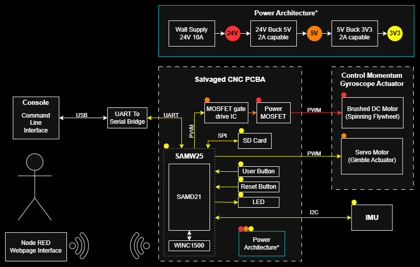

# a14g-final-submission

    * Team Number: 9
    * Team Name: Shorts & Sparks
    * Team Members: James Steeman and Tim Zhang
    * Github Repository URL: https://github.com/ese5160/a14g-final-submission-s25-t09-shorts-sparks
    * Description of test hardware: Detkin Desktop (Windows 10), MacBook Pro M2 (Mac OS), Our PCBAs, LSM6DSO IMU, Servo Motor, DC motor, our mechanical assembly
    
    (development boards, sensors, actuators, laptop + OS, etc) 

## 1. Video Presentation

## 2. Project Summary

### Device Description:  

Give a 2 sentence description of your device.

- Our final device is a boat active stabilization device (Seakeeper) to combat the rocking (roll) motion of a boat at sea due to waves, improving rider comfort. The system uses an IMU to detect boat tilting and uses the gyroscopic precession effect of a spinning flywheel to counteract the motion.
- For most of the semester, our project was a 3 axis CNC machine for milling prototype PCBs. Due to board issues discovered and isolated to problems outside of our control during board bringup, we worked with the Teaching Team to do a very late project change to salvage our PCB in a demoable project. Read here for more information on board issues: [Board Issues Google Document](https://docs.google.com/document/d/17aVozhZWAjP6q5agUZiOJsjJb8daSV915WeSpyRnOJc/edit?usp=sharing)

What inspired you to do the project? What problem is your device solving?

- The inspiration for our project was less of an "inspiration", more of a "maximize what we had". PCB manufacturing issues made our original project (3 axis CNC machine for milling prototype PCBs) impossible due to some critical component failures. We took everything that we found functional on our PCB, and asked ourselves what is the coolest project we could make. Specifically, the most functional of our three boards was semi functional including the SAMW25, MOSFET + gate drive IC for a big DC motor, separate SAMD21, stepper driver, all of the power regulation (24V, 5V, 3.3V) and a QWIIC connector for external I2C. From here, we came up with the boat stabilizer idea (control moment gyro/CMG) as it perfectly maximizes our functional hrdware. Our original CNC spindle motor was repurposed to spin a flywheel, the stepper motor connected to the SAMD21 could be used as the gimbal actuator (later decided to use a simple servo controlled by the SAMW25 instead), and the QWIIC connector allows us to connect an external IMU to measure a the tilt of a boat so that the CMG could actively compensate and counteract the rocking motion.

How do you use the Internet to augment your device functionality?

- The stabilization device could also be activated remotely (e.g. on a private yatch, the user does not need to go to the control room and could activate it from their phone/internet connected device). The data of the boat's tilt is also transfered live to a dashboard which anyone anywhere could see, such as friends and family on shore. In addition, this allows for additional features such as "text emergency contact" when the boat is detected to have capsized in rough waters.

### Device Functionality

Explain how your Internet-connected device is designed

- answer

Include sensors, actuators, and other critical components.

- answer

Include your system-level block diagram here.

- answer

### Challenges

Where did you face difficulties? This could be in firmware, hardware, software, integration, etc.

- Our major challenge was hardwware (and as a result a lack of time), due to unforseen factors from the manufactures that caused countless unfixable PCB issues (potentially wrong reflow temperature that killed the ICs). This quite literally killed our original project, leaving us only 3 days to try to implement and demo a new project from scratch.

- The new project suffered from lack of development/debugging time, with potential further hardware issues that we did not have time to pinpoint (unable to move our gimbal actuator as we could not get a second PWM to output from a different pin). This meant that we were unable to demonstrate the full integrated active roll compensation (which was the mian selling point). 

How did you overcome these challenges?

- These fundamental challenges were in a way "impossible" to overcome, but we were able to make the most out of what was possible. Over the course of 3 days given time and hardware constraints, we were able to: 
   1. Successfully completed a new mechanical CAD and finished the physical construction which had all the necessary features of a fully functioning CMG.
   2. Rebuilt our Node-Red rebuilt dashboard interface, integrated flywheel power setting, logging IMU data (boat tilt), manual/automatic activation of the system, OTAFU, boat capsize detection that will alert the dashboard and text a number.
   3. Wrote new drivers for our new I2C device (IMU), and successfully read out the data of interest and send over to dashboard for data visualization + logging.
   4. Wrote a motor control driver that will ramp up/dpwn the speed to any user set speed from the dashboard.

- Due to potentially even more hardware issue, we were unable to generate a second PWM for the gimbal actuator (servo), which unfortunately also limited our ability to do a full integration of everything. 

### Prototype Learnings

What lessons did you learn by building and testing this prototype?

What would you do differently if you had to build this device again?

### Next Steps & Takeaways

What steps are needed to finish or improve this project?

What did you learn in ESE5160 through the lectures, assignments, and this course-long prototyping project?

### Project Links

[Node Red UI Instance](http://172.190.141.169:1880/ui/#!/0?socketid=IxHLWtM_3o6IbezjAABr)

[Altium 365 Link](https://upenn-eselabs.365.altium.com/designs/DDC6BC9F-ABAE-498F-8839-63F1F02EF066)

## 3. Hardware & Software Requirements

Note: Since we had a late project change, we have created new HRS and SRS for the new project (post-facto) based on our goals when this project was created. We will attempt to evaluate our final output relative to these goals that reflect the ideal new project expectations.

### HRS

IMU shall sample at least at 200 Hz (we will request measurements at 200 Hz for kalman filter input)

MCU (capabilities?) (at least FM i2c?, WIFI, PWM, SPI, ..., flash space for bootloader and Application code)

SD card access at ... speed, sapce for application code files

DC motor driven at least 24V 5??A (MOSFET + gate drive) - show DC Eload as proof of capability

Use the PCBA made for the original project as much as possible

Stepper motor - Fail --> servo motor from another SAMW pin

### SRS

UART SAMW to SAMD for communication between mcus on board - Fail -->

PWM at 10khz (ish) for 

Ramp changes in dc motor PWM for ...

Node red / wifi interfacing for remote data show and user input

OTAFU implemented (show node red and / or cli) (note bootloader existance?)

Drivers?

Requests and receives imu data at 200 hz to input into 200hz kalman filter -> 100hz pid motor control loop

## 4. Project Photos & Screenshots

### Standalone PCBA, top

### Standalone PCBA, bottom

### Thermal Image of PCBA under laod

### Altium Board design 2D view

### Altium Board design 3D view

### Node-RED dashboard

### Node-RED backend

### Block diagram of your system

## Codebase

### Firmware

[Bootloader Folder in course repo](https://github.com/ese5160/final-project-t09-shorts-sparks/tree/main/Bootloader)

[Application Folder in course repo](https://github.com/ese5160/final-project-t09-shorts-sparks/tree/main/Application)

### Node-RED dashboard code

[Node-RED Dashboard Flows](http://172.190.141.169:1880/#flow/61499bec7a1919ef)

[Node-RED Dashboard UI](http://172.190.141.169:1880/ui/#!/0?socketid=omYwd3cGNLqyJbqNAAD4)

### Other Software

N/A
