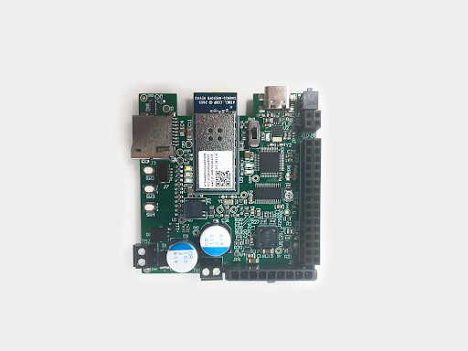
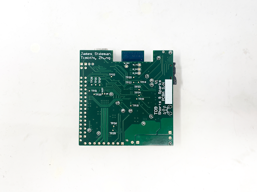
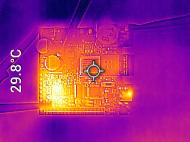
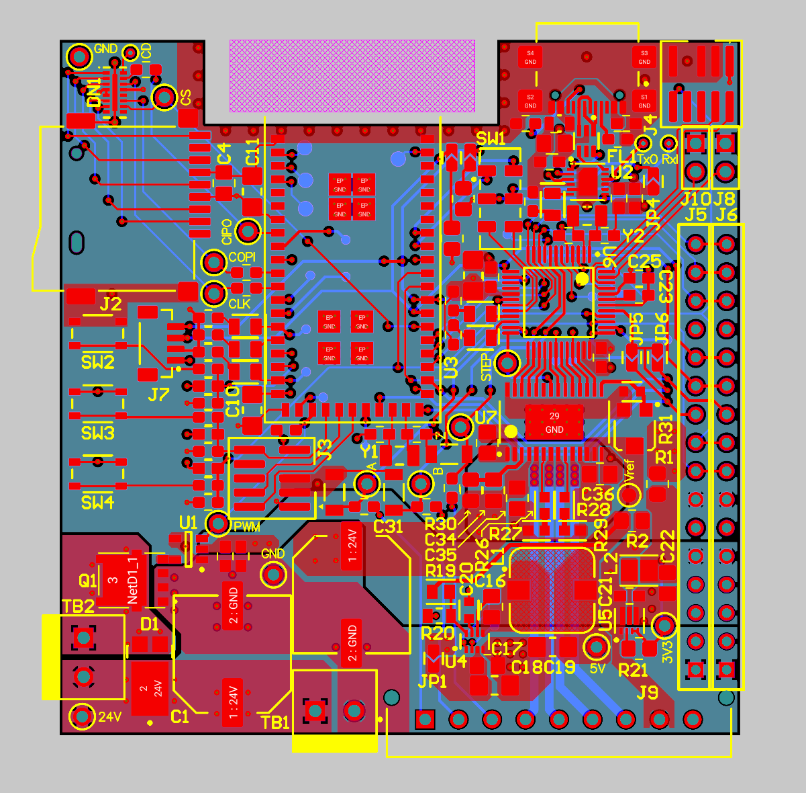
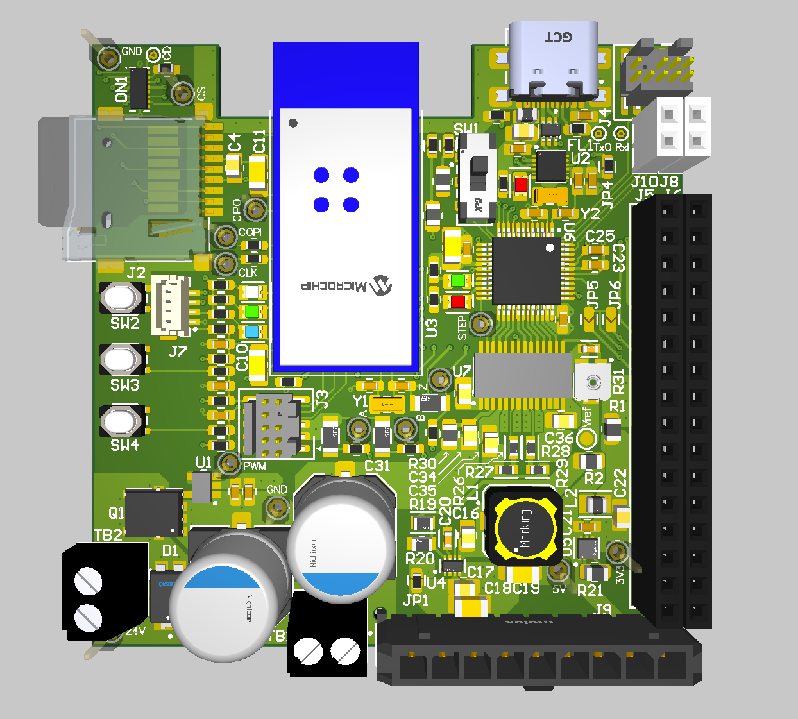
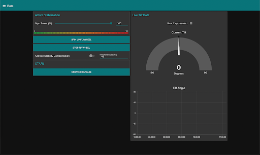
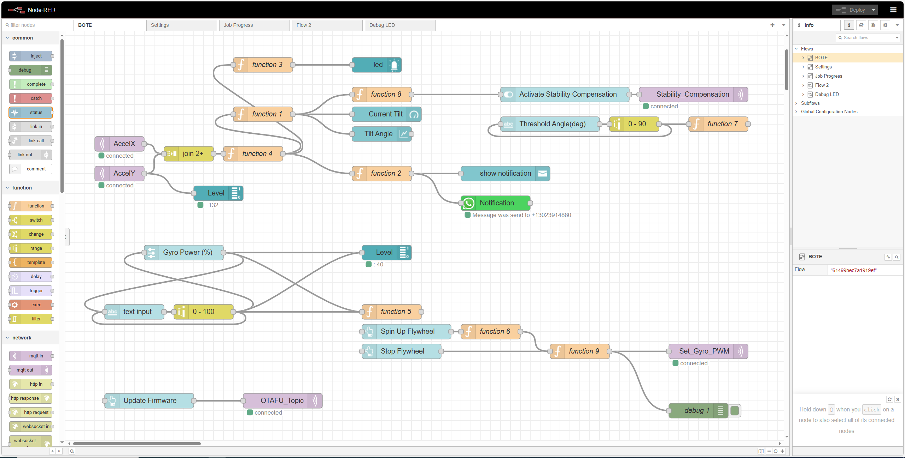

# a14g-final-submission

    * Team Number: 9
    * Team Name: Shorts & Sparks
    * Team Members: James Steeman and Tim Zhang
    * Github Repository URL: https://github.com/ese5160/a14g-final-submission-s25-t09-shorts-sparks
    * Description of test hardware: Detkin Desktop (Windows 10), MacBook Pro M2 (Mac OS), Our PCBAs, LSM6DSO IMU, Servo Motor, DC motor, our mechanical assembly
    
    (development boards, sensors, actuators, laptop + OS, etc) 

## 1. Video Presentation

## 2. Project Summary

### Device Description:  

A boat active stabilization device (Seakeeper) to combat the rocking (roll) motion of a boat at sea due to waves, improving rider comfort. The system uses an IMU to detect boat tilting and uses the gyroscopic precession effect of a spinning flywheel to counteract the motion.

### What inspired you to do the project? What problem is your device solving?

### How do you use the Internet to augment your device functionality?

The stabilization device could also be activated remotely (e.g. on a private yatch, the user does not need to go to the control room and could activate it from the comfort of their beedroom). The data of the boat's tilt is also transfered live to a dashboard which anyone anywhere could see, such as friends and family on shore. In addition, this allows for additional features such as "text emergency contact" when the boat is detected to have capsized in rough waters.

### Device Functionality

Explain how your Internet-connected device is designed

Include sensors, actuators, and other critical components.

Include your system-level block diagram here.

### Challenges

Where did you face difficulties? This could be in firmware, hardware, software, integration, etc.

How did you overcome these challenges?

### Prototype Learnings

What lessons did you learn by building and testing this prototype?

What would you do differently if you had to build this device again?

### Next Steps & Takeaways

What steps are needed to finish or improve this project?

What did you learn in ESE5160 through the lectures, assignments, and this course-long prototyping project?

### Project Links

[Node Red UI Instance](http://172.190.141.169:1880/ui/#!/0?socketid=IxHLWtM_3o6IbezjAABr)

[Altium 365 Link](https://upenn-eselabs.365.altium.com/designs/DDC6BC9F-ABAE-498F-8839-63F1F02EF066)

## 3. Hardware & Software Requirements

Note: Since we had a late project change, we have created new HRS and SRS for the new project (post-facto) based on our goals when this project was created. We are evaluating our final output relative to these goals of the ideal new project expectations.

### HRS

IMU shall sample at least at 200 Hz (we will request measurements at 200 Hz for kalman filter input)

MCU (capabilities?) (at least FM i2c?, WIFI, PWM, SPI, ..., flash space for bootloader and Application code)

SD card access at ... speed, sapce for application code files

DC motor driven at least 24V 5??A (MOSFET + gate drive) - show DC Eload as proof of capability

Use the PCBA made for the original project as much as possible

Stepper motor - Fail --> servo motor from another SAMW pin

### SRS

UART SAMW to SAMD for communication between mcus on board - Fail -->

PWM at 10khz (ish) for 

Ramp changes in dc motor PWM for ...

Node red / wifi interfacing for remote data show and user input

OTAFU implemented (show node red and / or cli) (note bootloader existance?)

Drivers?

Requests and receives imu data at 200 hz to input into 200hz kalman filter -> 100hz pid motor control loop

## 4. Project Photos & Screenshots

### Standalone PCBA, top

### Standalone PCBA, bottom

### Thermal Image of PCBA under laod

### Altium Board design 2D view

### Altium Board design 3D view

### Node-RED dashboard

### Node-RED backend

### Block diagram of your system

## Codebase

- A link to your final embedded C firmware codebases
- A link to your Node-RED dashboard code
- Links to any other software required for the functionality of your device

